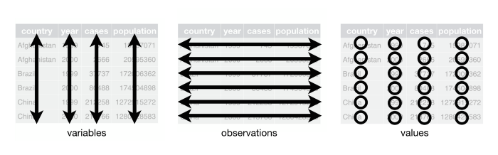

This is an adaptation of a second workshop I ran in 2022 as part of the Centre of Excellence for the Dynamics of Language (ANU) Seminar Series - I've subbed out the data I used in the workshop with the iris data again to make this content more accessible. If you would like a recording of the workshop, which uses vowel data, you can email me at elena.sheard@anu.edu.au  

```{r setup, include=FALSE}
#load the tidyverse
library(knitr)
library(tidyverse) 
```

```{r, eval=FALSE, echo=TRUE}
#install tidyverse if you haven't already
install.packages("tidyverse") 

#load the tidyverse
library(tidyverse) 
```


## Workshop Structure {.tabset}
- Introduction to dplyr
- Getting familiar with your data
- Cleaning your data
- Subsetting your data
- Transforming your data 
- Summarising your data
- Integrating dplyr and ggplot 

## Introduction to dplyr {.tabset}
### What is dplyr?
- A grammar of data manipulation
  * provides a consistent set of verbs that help you solve the most common data manipulation challenges
- Its functions expect *tidy data*
  * Each variable in its own column
  * Each observation in its own row
  
  
  
### Why should I learn it?
- Good for manipulating data 
  * Easier than manual changes and in most instances easier than base R 
  * Highly transferable skill (general data analysis)
- Commonly used by R users = plenty of resources 
- Allows you to create a workflow (e.g., create new spreadsheets from old ones without changing the original)
- Integrates with other tidyverse packages (like *ggplot*)


### The %>% operator 
- Dplyr can do multiple things to data in a single piece of code  
- To do this, we use the `%>%` operator
  * aka the 'pipe' operator 
  * Shortcut is Ctrl/Cmd + Shift + M 
- The pipe allows you to do multiple manipulations to the same data (like the + in ggplot2)
  * Do this, and then do this - order matters!


## Getting to know your data {.tabset}
### loading the data
- Run `df <- read_csv("my_dataframe_name.csv")` to read in your data files (although I will be using the Iris dataset here)
- `read_csv()` is similar to `read.csv()`
  * Faster for large .csv files 
  * Loads data as a Tibble (data format used by dplyr), read.csv() loads data as a regular data frame
  * If you ever need to convert a Tibble back to a conventional dataframe you can use `as.data.frame()`

### glimpse()
- `glimpse()` shows you every column in a data frame, the type of column it is in <>, and the values in of the first few rows of each column 
  * `<dbl>` stands for 'double', which is term sometimes used in programming languages for non-integer numbers (when manually changing factors in R you are likely using 'numeric' instead e.g., as.numeric(dataframe$column))
- `spec()` also does the same thing, but doesn't include the values of the first few rows
- You can use this to find column names in the activites throughout the workshop

```{r}
iris %>% 
  glimpse()

```


### distinct()
- Used to find unique elements of a given attribute (i.e., the different levels of a factor or categorical variable)
- `data %>% distinct(column_a)`

```{r}
iris %>%
  distinct(Species)
```


## Cleaning your data {.tabset}
### rename()
- Used for renaming columns
- You must specify the new name first
- `data %>% rename(new_col_name_1 = old_col_name_1)`
- A useful function if your column names have spaces
  * R does not like spaces, and will insert full stops when you load your data
  
```{r,eval=FALSE}
iris %>%
  rename(sepal_length = Sepal.Length, 
         sepal_width = Sepal.Width,
         petal_length = Petal.Length,
         petal_width = Petal.Width)
```


### arrange()
- Sorts your data by individual columns
- `data %>% arrange(column_a)`
- Default is in ascending/alphabetical order. To arrange in descending order you can: 
- `data %>% arrange(desc(column_a))`
  
```{r, eval=FALSE}
#Sort rows by duration in ascending order
iris %>%
  arrange(sepal_length) 

#Sort rows by duration in descending order
iris %>%
  arrange(desc(sepal_length)) 

```


## Subsetting your data {.tabset}
### select()
- When you want to select specific *columns* from your data
- There are two approaches:
  * Naming the columns you **do** want
  * Naming the columns you **don't** want
- To select the columns you **do** want:
  * `data %>% select(column_a, column_b, column_c)`
  * compared to `data[,c("column_a", "column_b", "column_c")]` in base R
- To remove the columns you **don't** want:
  * `data %>% select(-column_d, -column_e, -column_f)`
  * I do not know how to do this in base R and did not think figuring it out was worth my time
- You do **not** need to have the column names in " " 
- You can also use `:` to tell R you want to select all the columns between column a and column x
  * `data %>% select(column_a:column_z)`
- If you have a lot of columns with similar names, you can also select them using `contains()`
  * `data %>% select(contains(match))`
- There are other ways to make selection more specific:
  * `ends_with(match)`, `starts_with(match)`, `match(match)`, `num_range()`

```{r, eval=FALSE}
#select  specific columns from 'iris'  
iris %>%
  select(petal_length, petal_width) 

#select all columns from speaker to vowelSpecificContext
iris %>%
  select(sepal_length:petal_length)

#select all columns where the name contains 'F1'
iris %>%
  select(contains("sepal"))

#select all columns ending with "e"
iris %>%
  select(ends_with("dth"))

#select all columns starting with "a"
iris %>%
  select(starts_with("s"))
```


### filter()
- When you want to select specific *rows* from your data
  * `data %>% filter(column_a == "level_1")`
  * Compared to `data[data$column_a == "level_1",]` in base R
  
- Use the `%in%` operator when you want to specify multiple levels of the column
  * `data %>% filter(column_a %in% c("level_1", "level_2", "level_3"))`
  * Compared to `data[data$column_a %in% c("level_1", "level_2", "level_3"),]` in base R

- You can also exlude columns using `!=` (not equal to)
  * `data %>% filter(column_a != "level_2")`
  * `data %>% filter(!column_a %in% c("level_2", "level_3"))`

- You can filter by multiple columns and levels!
  * `data %>% filter(column_a == "level_1", column_b == "level_2)`
  
- If you want to create a separate tibble/dataframe to analyse, remember to assign to a new object 
  * `new_df <- data %>% filter(column_a == "level_1", column_b == "level_2")`
  
```{r, eval=FALSE}

#select the rows that have 'setosa' in the 'setosa' column
iris %>% filter(Species == "setosa") 

#select the rows that have a sepal length greater than '5' and have 'setosa' in the 'setosa' column
iris %>% filter(Species == "setosa" & sepal_length > 5)

#select the rows do not have 'setosa' in the 'Species' column
iris %>% filter(Species != "setosa")

#select the rows do not have 'setosa' or 'versicolor' in the 'Species' column
iris %>% filter(!Species %in% c("setosa", "versicolor"))

```


### Activity 1
- Rename three columns in the data frame (use `glimpse()` to choose) 
  * `iris %>% rename(=, =, =)`
- Select the first 3 columns of the data frame
  * `iris_3 <- iris %>%  select()`
- Select all columns containing the letter 'a'
  * `iris_a <- iris %>% select(contains())`
- Select all columns except the column 'Species'
  * `iris_noSp <- iris %>% select()`

## Transforming your data {.tabset}
### unite()
- This will combine two columns into a single column
- Will unite based on the specified order, not their order in dataframe

```{r, eval=FALSE}
#create new column and keep the originals 
iris %>%
  unite(species_petal_length, c("Species", "petal_length"), remove = FALSE) 

#create new column and remove the originals 
iris <- iris %>%
  unite(species_petal_length, c("Species", "petal_length")) 

```

### separate()
- Turns a single character column into multiple columns
- Default is to split column in question based on any non-alphanumeric value (e.g., a space, hyphen, comma), but this can be specified with `sep = ''`

```{r, eval=FALSE}
#create new column and remove the originals 
iris <- iris %>%
  separate(species_petal_length, c("Species", "petal_length"), 
           sep = "_") 

#create new column and keep the originals
iris %>%
  separate(species_petal_length, c("Species", "petal_length"), remove = FALSE)  
```

### mutate()
- Used to create new columns, often based on other columns already in the data
  * `data %>% mutate(new_column = condition/value/expression)` 
- Can also be used to change existing columns without creating a new one
  * `data %>% mutate(existing_column = condition/value/expression)`
  
```{r, eval=FALSE}
#create a new column that is the product of F2-F1
iris <- iris %>%
  mutate(length_minus_width = sepal_length - sepal_width)

#Modify an existing column that is the log of F1_lob
iris %>%
  mutate(petal_width = log10(petal_width))

```


### ifelse()
- Commonly used within the mutate() function
- Lets you create an if-else statement without writing multiple lines of code
- Useful if you only want to alter some levels of a factor, or the value in the column is conditional 
- `mutate(new_column = ifelse(condition, "value_1","otherwise_value_2"))`

```{r, eval=FALSE}
# Create a new column called 'short_petal'
# If the value in the 'petal_length' column is greater than 3, put "long" 
# Otherwise put "short"

iris <- iris %>%
  mutate(short_petal = ifelse(petal_length > 3, "long", "short")) 

# create a new column called 'width'
# If the value in the 'petal_width' column is less than 0.5 then put "thin" 
# Otherwise put the same values as in the 'Species' column

iris %>%
  mutate(width = ifelse(petal_width < 0.5, "thin", Species)) 
```

### case_when()
- An alternative to if_else if you want to change many or all levels of a factor that saves on multiple lines of code

```{r, eval=FALSE}
#Create a column called "petals" that classifies rows with a petal length 
# greater than 3 as "long", between 3 and 1 as "medium" 
# and less than or equal to 1 as "short"

iris <- iris %>%
  mutate(petals = case_when(petal_length > 3 ~ "long", 
                            petal_length < 3 & petal_length > 1 ~ "medium",
                            petal_length <= 1 ~ "short")) 
```


### fct_recode()
- Used to recode data types (good practice is to recode columns when loading data)
  * Main data types are integer, double (other numbers), character, factor
- You may need to convert some columns to factors from characters, or vice versa 

```{r, eval=FALSE}
# Convert some columns to factors 
  # Across() instructs R to do the manipulation across multiple columns
# Recode species to be capitalised
iris %>%
  mutate(across(c(Species), factor)) %>% 
  mutate(Species_recode = fct_recode(Species, "Setosa" = "setosa",
                               "Versicolor" = "versicolor",
                               "Virginica" = "virginica")) %>% 
  select(Species,Species_recode)
```


### Activity 2
- Create a new column that combines the species and sepal length columns, and keeps the original columns
  * `iris <- iris %>% unite(new_column,c("column_a","column_b"),remove=)`
- Create a new column that contains the product of speal length multiplied by petal length (use * to indicate multiplication)
  * `iris <- iris %>% mutate(new_column = expression)`
- Create a new column where, if the sepal length is above 2, it is 'short', and it is otherwise 'long'
  * `iris <- iris %>% mutate(new_column = ifelse(condition,"value_1","value_2"))`
- Create a new column where, if the species is seposa it is changed to 'Seposa', and it is otherwise 'not seposa' 
  * `iris <- iris %>% mutate(new_column = ifelse(condition,"value_1","value_2"))`
- Create a new column where, if Species is seposa it is changed to 'Seposa', but otherwise is the same as the Species column 
  * `iris <- iris %>% mutate(new_column = ifelse(condition,"value_1",original_column))`


## Summary Statistics {.tabset}
### summarise()
- `summarize()` or `summarise()` operators are useful for creating summary statistics on a dataset (e.g., frequency counts, average values)
- Used in combination with other functions (e.g., functions that calculate averages)
- If there is no grouping are performed, the result is a single value
- `data %>% summarize(column_a = mean(column_a))` will calculate the average value in column a for the whole dataframe

```{r,eval=FALSE}
#calculates average sepal length for the whole dataframe
iris %>% 
  summarise(mean(sepal_length)) 

#calculate average, median, maximum and minimum sepal length 
#for the whole dataframe again
iris %>% 
  summarise(mean(sepal_length),
           median(sepal_length),
            max(sepal_length),
            min(sepal_length))

#You can also create new columns names 
iris %>% 
  summarise(Average = mean(sepal_length),
            Median = median(sepal_length),
            Maximum = max(sepal_length),
            Minimum = min(sepal_length))

```

- If you want to calculate this value *across different groups*, you can combine `summarise()` with `group_by()`


### group_by()
- Usually used in combination with other functions such as summarise()
- Groups your data by the levels/categories in the columns you select
  * `data %>% group_by(column_a, column_b) %>% summarize(column_y = mean(column_z))` 
  
```{r, eval=FALSE}
# Groups the data by gender
# Calculates the mean and median F1 value for each group
iris %>% 
  group_by(Species)%>% 
  summarise(Average_sepal_length = mean(sepal_length),
            Median_sepal_length = median(sepal_length))

```


### Useful functions for summaries
- These can all be used within summarise()
- *Center*
  * mean(): calculate average
  * median(): calculate median
- *Count*
  * n(): count number of rows
  * n_distinct(): count number of unique rows
- *Spread*
  * sd(): calculate standard deviation
  * IQR(): calculate the interquartile range
  * mad(): calculate the median absolute deviation
- *Range*
  * min(): minimum value
  * max(): maximum value
  * quantile(): quantile
- *Position*
  * first(): Extract the first element of a vector
  * last(): Extract the last element of a vector
  * nth(): Extract the nth element of a vector (specify position with number)
- *Logical* 
  * any(): Report whether any elements are TRUE
  * all(): Report whether all elements are TRUE

- n() will count the number of rows (i.e., token numbers)

```{r, eval=FALSE}
# Count the number of rows per Species
# And count the number of unique petal lengths per speaker
iris %>% 
  mutate(across(c(Species, petals), factor)) %>% 
  group_by(Species)%>% 
  summarise(Count = n(),
            Unique_petals = n_distinct(petals)) 

```

### Activity 3: Summary statistics
- Calculate the average petal length (summarise) for each speciies (group by) and sort in descending order. Which group has the longest petal 
  * `iris %>% group_by(,, ) %>% summarise( = mean()) %>% arrange(desc())`
- Calculate the standard deviation of petal length for each Species 
  * `iris %>% filter(age=="") %>% group_by(,) %>% summarise( = sd()) %>% arrange(desc())`
- If you have time, try and find your own summary statistics 

## Combinging multiple data sets: joining {.tabset}
- The following joins add variables from one dataframe (x) to another dataframe (y) based on (specified) *matching observations* (values in columns) between the two dataframes
- Common situation: joining metadata information to linguistic information from separate spreadsheets
  * Metadata has fewer rows (one per speaker) than linguistic data (multiple rows per speaker)
- It is also fine to use `merge()` if you're already comfortable with it
  * `merge()` is capable to doing all of these joins, depending on what you specify for the arguments
- All join functions require you to specify the column(s) by which you want to join the two data frames
  * These columns must have the **same name**
  * The values in these columns must also **match** or the join will not work/be incomplete

### left_join():
- Returns all rows in x and all columns from x and y
- Rows in x with no match in y will have NA values in the new columns

](images/left_join.png)
    
### right_join()
- Returns all rows in y and all columns from x and y
- Rows in y with no match in x will have NA values in the new columns

](images/right_join.png)

### inner_join()
- Returns all rows from x *only* where there are matching values in y
- Shared observations in both dataframes
- I like to use this join because it is easier to spot where rows have gone missing (usually because the ID value does not match)
- `merge()` function by default performs inner join: it returns only the rows in which the left table have matching keys in the right table

](images/inner_join.png)
    
### full_join()
- Returns all rows in x *or* y
- All rows and columns from both x and y. NA where there are not matching values.

](images/full_join.png)

### semi_join()
- Return all rows from x where there are matching values in y, keeping just columns from x

](images/semi_join.png)

### anti_join()
- Includes all observations in x that do not have a match in y
  * Keeps just columns from x
  * Can be helpful for identifying mismatched values (e.g., It will extract the filenames that are slightly different between dataframe x and dataframe y and therefore cannot be joined or merged)
  
](images/anti_join.png)

## Integrate with ggplot {.tabset}
- One of my favourite aspects of dplyr is that you can subset data directly into ggplot visualisations 
  * Meaning you don't have to be constantly creating new subsetted dataframes 

### Average midpoint
- Here I want to visualise the average petal length and sepal length for each Species
- `group_by(Species)` to group by Species
- `summarise(petal_length = mean(petal_length))` to calculate the average petal length values for each group
- Move into ggplot and switch to `+` instead of pipe

```{r, eval=FALSE}
iris %>% 
  mutate(petal_length = as.numeric(petal_length)) %>% 
  group_by(Species) %>% 
  summarise(petal_length = mean(petal_length),
            sepal_length = mean(sepal_length)) %>% 
  ggplot(aes(x = petal_length, y = sepal_length, color = Species)) +
  geom_point() +
  theme_bw()
```


```{r, echo=FALSE}
iris %>% 
  group_by(Species) %>% 
  summarise(Petal.Length = mean(Petal.Length),
            Sepal.Length = mean(Sepal.Length)) %>% 
  ggplot(aes(x = Petal.Length, y = Sepal.Length, color = Species)) +
  labs(x = "petal_length", y = "sepal_length") +
  geom_point() +
  theme_bw()
```


### Sepal length
- Boxplot of sepal length for all species except setosa
- Boxplots need all data points (not just averages), so `summarise()` is not necessary (but you could filter out a specific point of the vowel)

```{r, eval=FALSE}
iris %>% 
  filter(Species != "setosa") %>%
  ggplot(aes(x = Species, y = sepal_length)) +
  geom_boxplot() +
  theme_bw()

```


```{r, echo=FALSE}
iris %>% 
  filter(Species != "setosa") %>%
  ggplot(aes(x = Species, y = Sepal.Length)) +
  geom_boxplot() +
  labs(y = "sepal_length") +
  theme_bw()

```


### Activity 5
- Try and make your own combination of dplyr functions and ggplot 

## Sources and resources
https://dplyr.tidyverse.org/  
https://r4ds.had.co.nz/transform.html  
https://bookdown.org/ansellbr/WEHI_tidyR_course_book/manipulating-data-with-dplyr.html  
http://statseducation.com/Introduction-to-R/modules/tidy%20data/gather/  
https://rpubs.com/williamsurles/293454 
https://www.datasciencemadesimple.com/join-in-r-merge-in-r/#:~:text=We%20can%20merge%20two%20data,database%20join%20operation%20in%20SQL. 
https://statisticsglobe.com/r-dplyr-join-inner-left-right-full-semi-anti 